# CS374 Hotel Database Final Report
*Marcus Tran and Matthew Berggren*

## ER Model
*insert the image here*

ER model changes from HW 7:
-	changed total_price to “price” for the SERVICE_TYPE table
-	Added a “Status” string to RESERVED_ROOM table
-	Added a “Status” string to BILL table
-	Removed “Category_type” from GUEST table
-	Removed “is_guest” from OCCUPANTS table
-	Renamed date/time to “BookingDateTime” for clarity in RESERVATION
-	Added a “CAN BE A” relation between Room and Reserved_Room
-	Removed Quantity field in Reserved_Room

## Relational Model
*insert the image(s) here*

Relational Model / drop_create_tables.sql changes from HW 7:
-	changed total_price to “price” for the SERVICE_TYPE table
-	Removed “Category_type” from GUEST table
-	Removed isGuest Boolean in OCCUPANTS, replaced with a nullable GuestID reference to the GUEST table
-	Changed ServiceTypeName to not null
-	Changed Services table to all caps “SERVICES” to reflect the naming norms of the database
-	Changed DateTime to BookingDateTime for clarity in RESERVATION
-	Changed type of GuestID FK in OCCUPANT to Int instead of Boolean
-	Change type of DiscountPercent in CATEGORY from Int to decimal(5,2) to reflect percentages and make math easier when calculating the discount in the queries.
-	Added a nullable RoomID FK to RESERVED_ROOM to reference ROOM. This ensures sure you can directly connect and relate the reserved room to the specific room ID number in the database.
-	Removed the Quantity field in RESERVED_ROOM
-	Added a “Status” string to RESERVED_ROOM table so it can have values like “Checked-in” or “unreserved”

## Database creation
*Link the files here*

- Drop tables: [drop_fk.sql](./database/drop_fk.sql)
- Create tables: [drop_create_tables.sql](./database/drop_create_tables.sql)
- Add constraints to tables: [add_fk.sql](./database/add_fk.sql)

We changed the scripts to match updated model shown in previous section. The only real change was to the create.sql, where we added an index.

## Data

- Add some data from csv files: [load.sql](./data/load.sql)
     - [room.csv](./data/room.csv)
- Add some data from using Python and faker: [generate.py](./data/generate.py)
- Separate file called hw8_generate.py for demonstration in class using marcus's pgadmin. [hw8_generate.py](./data/hw8_generate.py)

We made three changes to the data to support the queries. First, we added fake.seed_instance(42) so that Faker-generated values (addresses, phone numbers, ID numbers) are reproducible across runs. Second, we restructured the room type and room ID lookups into dictionaries (rt_ids[hotel][type_name] and room_ids[rtid]) for cleaner reference throughout the reservation setup. Third, we switched the per-day price multiplier to be assigned once per room type rather than re-rolled each season, guaranteeing that weekday prices differ from one another consistently — which is required for Q1 (Tue ≠ Wed) and Q3 (Fri ≠ Sat). Static insert statements were used instead of Faker for all query-critical fields: hotel names, season dates, room type definitions, service type names, guest categories, and all reservation/bill/occupant rows tied to the five query scenarios.

## Queries
- General query file: [queries.sql](./queries/queries.sql)
### Here are the steps to do before each query:
- Step 0: drop tables
by running [drop_fk.sql](./database/drop_fk.sql)
- Step 1: build the schema
by running [drop_create_tables.sql](./database/drop_create_tables.sql)
- Step 2: add fk
by running [add_fk.sql](./database/add_fk.sql)
- Step 3: generate data
by running [generate.py](./data/generate.py) or [load.sql](./data/load.sql) if on pgadmin only
- Step 4: run the queries below

EXISTING DATA OVERVIEW:
  Hotel A = The Grand Shenandoah (Harrisonburg, VA)
    - Season: High Season (Jun 1 - Aug 31 2025)
    - Room types: Standard Single, Double, Suite
    - Pre-loaded condition: one Standard Single room is already
      checked_in from Jul 15-17 by an existing guest, so it will
      not appear as available in Query 1.

  Hotel B = Blue Ridge Inn (Staunton, VA)
    - Season: Summer Season (May 25 - Sep 1 2025)
    - Room types: Standard Single, Double
    - Pre-loaded condition: one Double room is already checked_in
      from Jul 18-21 by an existing guest (Laura Torres equivalent),
      so it will not appear as available in Query 2.
    - Pre-loaded condition: Mrs. Smith (gold guest) already has a
      reservation for a Double room checking in Jul 18 2025 with
      Status = 'reserved'. Mr. Smith does not yet exist in the DB.
### Query 1

- [q1.sql](./queries/q1.sql)
Query 1 Explanation:
  - The Grand Shenandoah has 3 room types: Standard Single,
    Double, and Suite.
  - One Standard Single room is already checked_in for Jul 15-17,
    meaning ALL Standard Single rooms of that type are blocked
    and should not appear in the availability results.
  - Room prices are set per day of week within the current season
    (High Season). Jul 15 is a Tuesday and Jul 16 is a Wednesday,
    and each day has its own rate, so the average across the two
    nights will reflect both day-of-week and season pricing.
  - The gold category has a 15% discount which is applied to the
    average nightly price shown to the guest.

EXPECTED SELECT RESULT:
  Double and Suite appear with their discounted avg nightly rate.
  Standard Single does NOT appear.

1a) SELECT: available room types with season- and day-adjusted
    average cost per night, after gold discount.
    Filters to the correct season covering Jul 15-16 and only
    pulls prices for Tue and Wed (the two nights of the stay).

1b) INSERT: add the new gold guest to the database.
    This guest did not previously exist. IdNumber PA99001122
    is used to look them up in the subsequent inserts.

1c) INSERT: create a reservation for the new guest at Hotel A.
    Uses a subquery to find the GuestID by IdNumber so no
    hardcoded ID is needed.

1d) INSERT: reserve a Double room for Jul 15-17.
    Double was chosen because it appeared as available in 1a.
    RoomID is NULL at booking time — a specific room is only
    assigned at check-in.

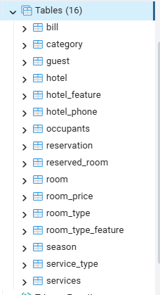
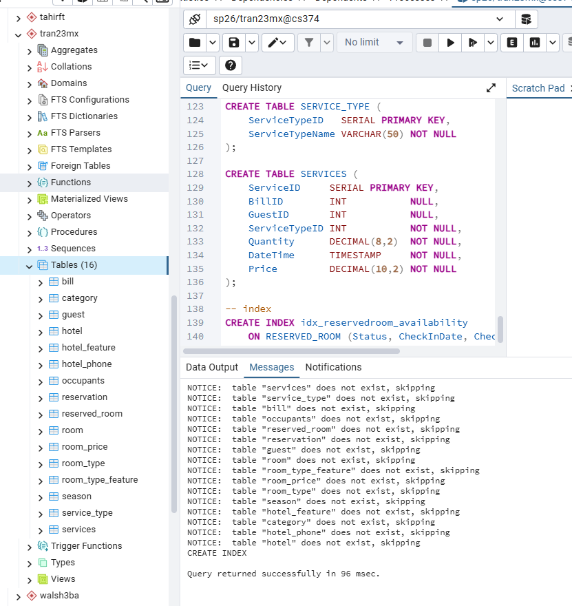
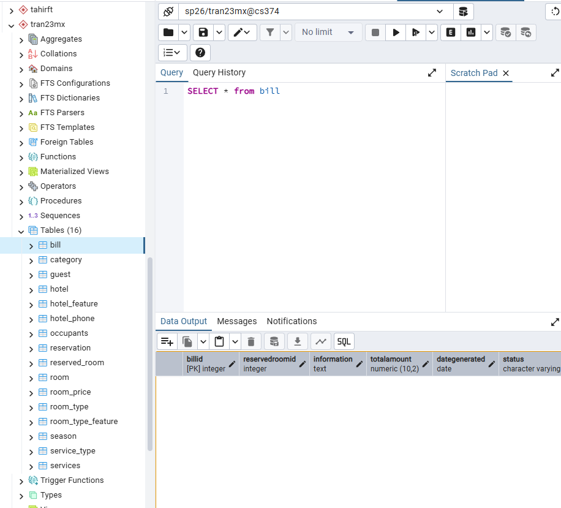
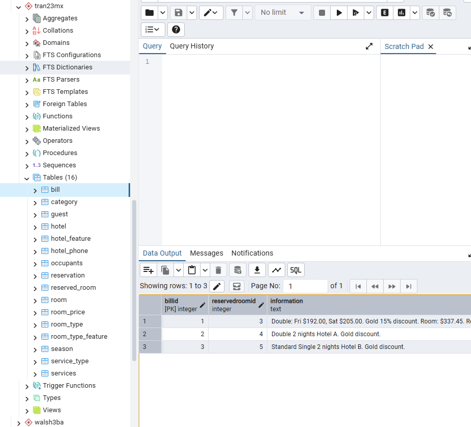
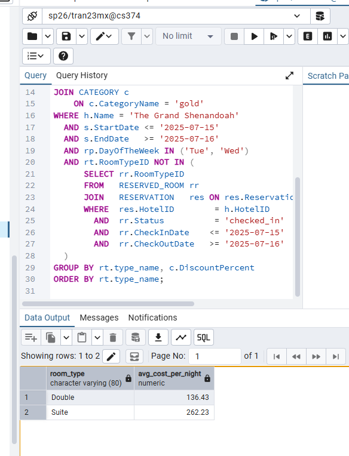
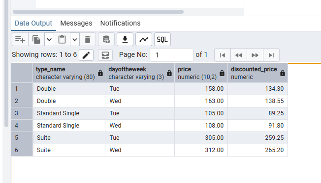

### Query 2
Query 2 Explanation:
EXISTING DATA:
  - Blue Ridge Inn has 3 Double rooms (room numbers vary by
    load order, but 3 were inserted by the loader).
  - One of those Double rooms is already checked_in from Jul 18
    to Jul 21 by another guest. That room will be excluded from
    the available rooms list returned by the select query.
  - Mrs. Smith's reservation already exists in RESERVATION and
    RESERVED_ROOM with Status = 'reserved' and CheckInDate =
    '2025-07-18'. Her GuestID exists in GUEST with category 'gold'.
  - Mr. Smith does NOT exist in the database yet — he is added
    as a new guest in 2b.

EXPECTED SELECT RESULT:
  2 of the 3 Double rooms appear as available (the occupied one
  is excluded).

2a) SELECT: Double rooms at Blue Ridge Inn not currently occupied
    on Jul 18. Excludes any room where a checked_in reservation
    overlaps that date.

2b) INSERT: add Mr. Smith as a new guest.
    He was not previously in the database. No category assigned
    since he is not a registered loyalty member.

2c) UPDATE: assign an available Double room to Mrs. Smith's
    reserved room row and set Status to checked_in.
    The subquery picks the first available Double room at
    Blue Ridge Inn that is not already checked_in.
    
2d) INSERT: record Mrs. Smith as an occupant of the room.
    Her GuestID is linked because she is a registered guest.

2e) INSERT: record Mr. Smith as an occupant.
    He was just added in 2b. His GuestID is looked up by
    IdNumber since he has no prior record.

- [q2.sql](./queries/q2.sql)

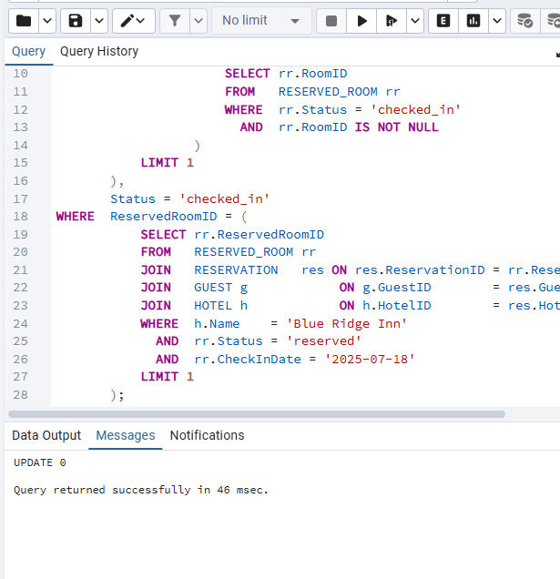
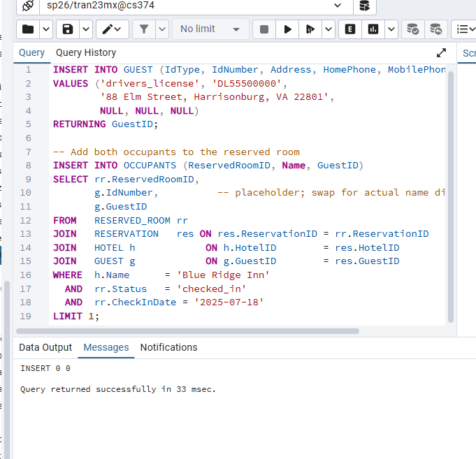
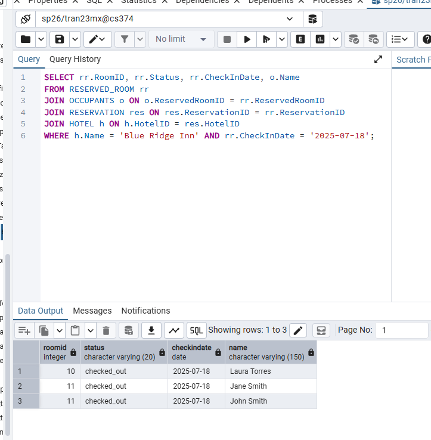

### Query 3
Query 3 Explanation:
EXISTING DATA:
  - Mrs. Smith's RESERVED_ROOM row covers Jul 18-20 (Fri-Sun).
    Jul 18 is a Friday and Jul 19 is a Saturday, so the two
    nights have different ROOM_PRICE entries (Fri rate vs Sat
    rate), satisfying the requirement that price is not the
    same on every night.
  - The stay falls fully within Summer Season (May 25 - Sep 1),
    so season pricing is consistent throughout.
  - Mrs. Smith is a gold guest (15% discount), which changes
    the total price of the reservation.
  - A BILL record already exists for her stay from the loader.
    Query 3a adds one additional room service charge to that bill.

EXPECTED SELECT RESULT:
  One row showing check-in/out dates, room type, the Fri and Sat
  nightly rates (which differ), the discounted room subtotal,
  the room service charge, and the grand total.

3a) INSERT: add a room service charge to Mrs. Smith's bill.
    This demonstrates adding an extra service to an existing bill.

3b) SELECT: billing statement for Mrs. Smith.
    Joins through SEASON to get the correct seasonal prices,
    then explicitly fetches the Fri and Sat ROOM_PRICE entries
    to show the nightly rate variation. Applies the gold
    category discount to the room subtotal. Sums all service
    charges from SERVICES via the BILL.
    
3c) UPDATE: mark the reserved room as checked_out.

3d) UPDATE: mark the reservation itself as checked_out.

- [q3.sql](./queries/q3.sql)

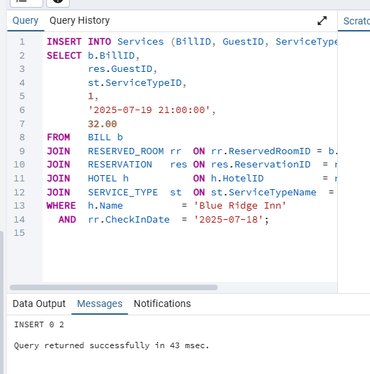
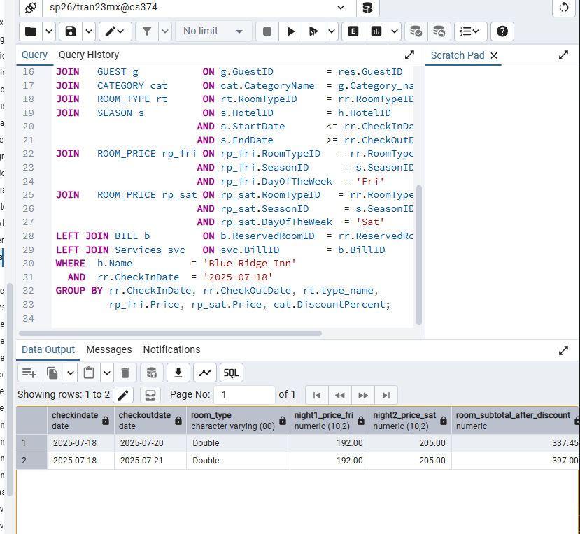
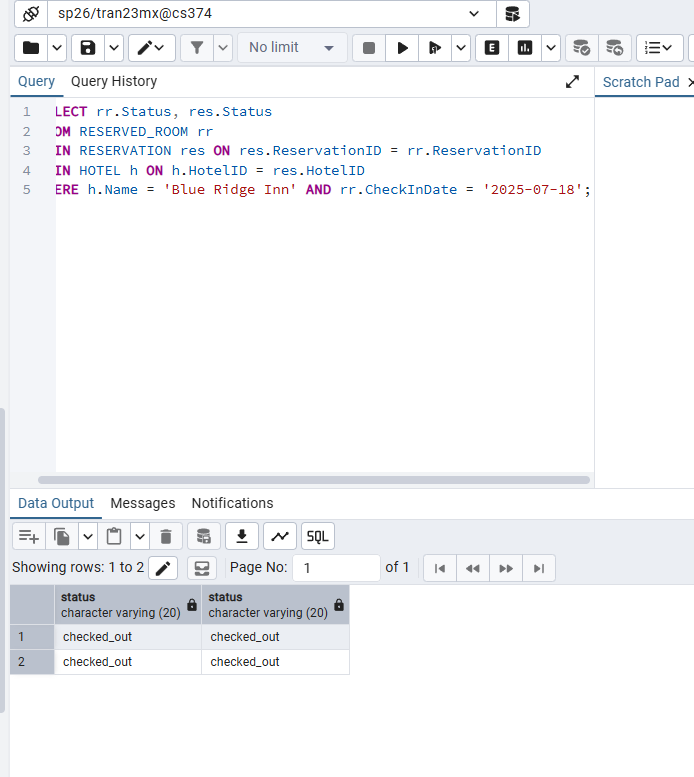

### Query 4
Query 4 Explanation:
EXISTING DATA:
  - Mrs. Smith's room at Blue Ridge Inn on Jul 18 has two
    occupants recorded in OCCUPANTS: Mrs. Smith herself
    (the reserver, a registered guest with GuestID linked)
    and Mr. Smith (added as a new guest at check-in, also
    linked by GuestID). This guarantees the query returns
    at least 2 people for that room and date.

EXPECTED RESULT:
  Two rows — one for Mrs. Smith and one for Mr. Smith —
  both showing the same room number and check-in date,
  along with the reserver's ID number.
- [q4.sql](./queries/q4.sql)

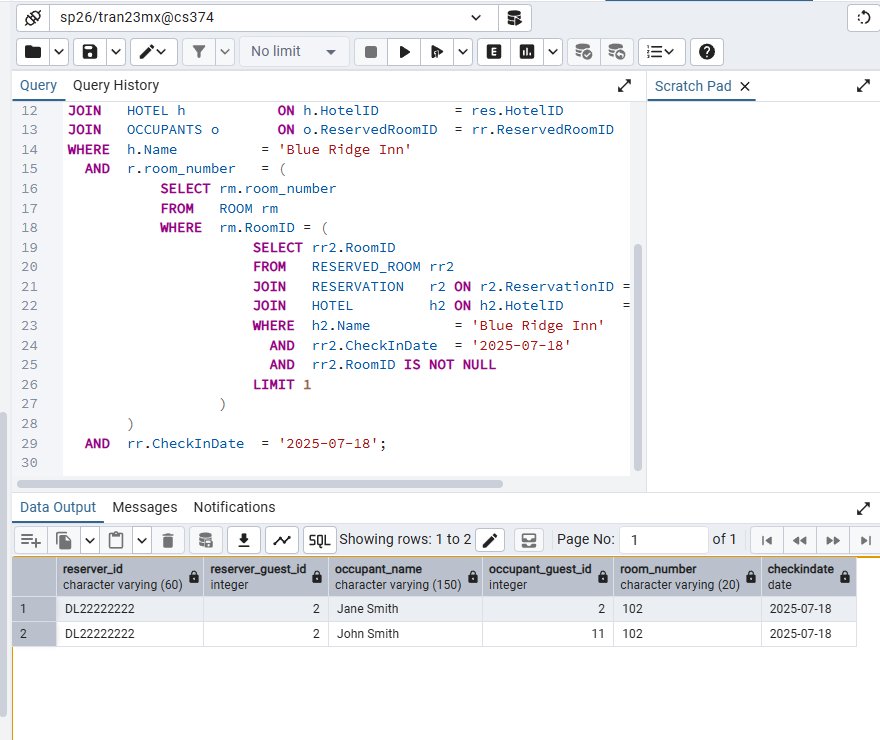

### Query 5
Query 5 Explanation:
EXISTING DATA:
  - One gold guest (Robert Chen equivalent, guest_ids[2] in
    the loader) has two completed stays in 2025:
      1. The Grand Shenandoah, Aug 5-7 2025 (Double room,
         within High Season, gold discount applied)
      2. Blue Ridge Inn, Sep 5-7 2025 (Standard Single,
         within Off Season, gold discount applied)
    Both stays have BILL records with TotalAmount populated,
    including extra service charges added on top.
  - No other guest has stays at 2+ different hotels in 2025,
    so only this one guest should appear in the results.

EXPECTED RESULT:
  One row showing the guest's ID number, gold category,
  2 hotels visited, 2 reservations, and the combined total
  spent across both stays including services.
- [q5.sql](./queries/q5.sql)

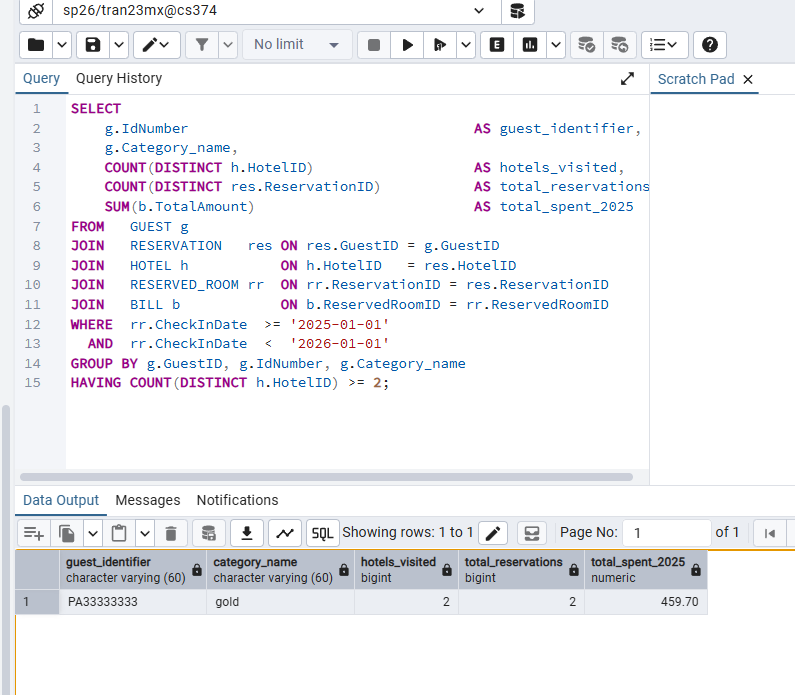
