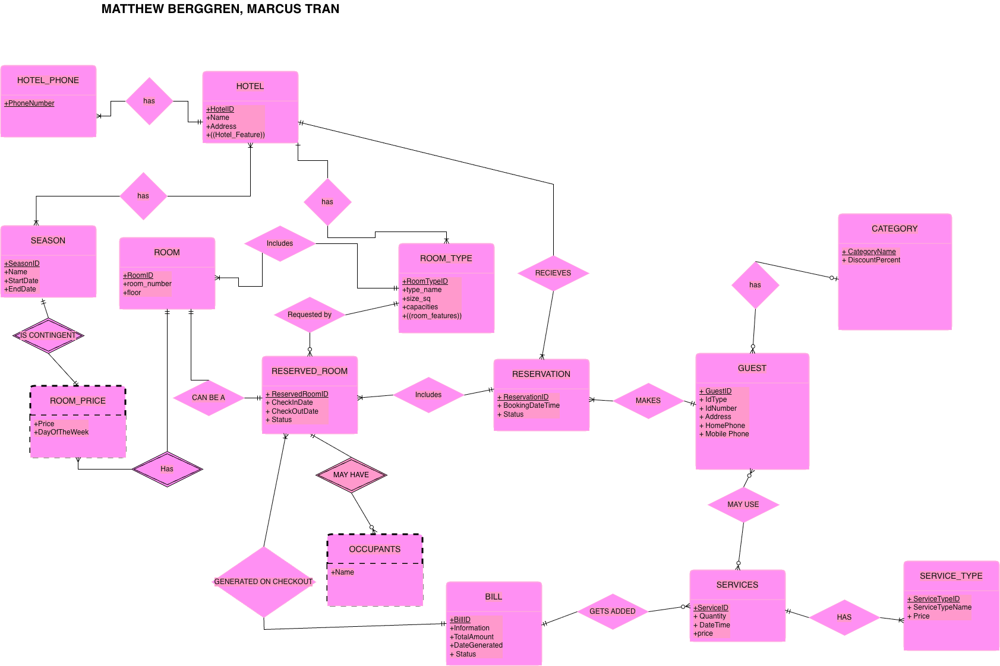
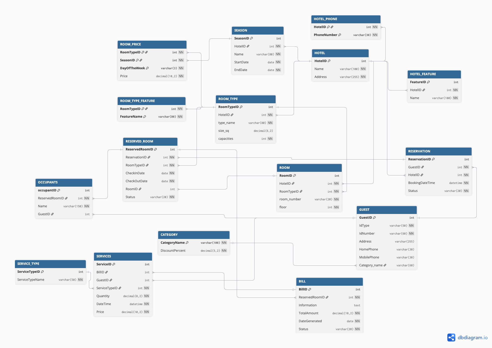

# CS374 Hotel Database Final Report
*Marcus Tran and Matthew Berggren*

## ER Model
*insert the image here*

ER model changes from HW 7:
-	changed total_price to “price” for the SERVICE_TYPE table
-	Added a “Status” string to RESERVED_ROOM table
-	Added a “Status” string to BILL table
-	Removed “Category_type” from GUEST table
-	Removed “is_guest” from OCCUPANTS table
-	Renamed date/time to “BookingDateTime” for clarity in RESERVATION
-	Added a “CAN BE A” relation between Room and Reserved_Room
-	Removed Quantity field in Reserved_Room

## Relational Model
*insert the image(s) here*

Relational Model / drop_create_tables.sql changes from HW 7:
-	changed total_price to “price” for the SERVICE_TYPE table
-	Removed “Category_type” from GUEST table
-	Removed isGuest Boolean in OCCUPANTS, replaced with a nullable GuestID reference to the GUEST table
-	Changed ServiceTypeName to not null
-	Changed Services table to all caps “SERVICES” to reflect the naming norms of the database
-	Changed DateTime to BookingDateTime for clarity in RESERVATION
-	Changed type of GuestID FK in OCCUPANT to Int instead of Boolean
-	Change type of DiscountPercent in CATEGORY from Int to decimal(5,2) to reflect percentages and make math easier when calculating the discount in the queries.
-	Added a nullable RoomID FK to RESERVED_ROOM to reference ROOM. This ensures sure you can directly connect and relate the reserved room to the specific room ID number in the database.
-	Removed the Quantity field in RESERVED_ROOM
-	Added a “Status” string to RESERVED_ROOM table so it can have values like “Checked-in” or “unreserved”

## Database creation
*Link the files here*

- Drop tables: [drop_fk.sql](./database/drop_fk.sql)
- Create tables: [drop_create_tables.sql](./database/drop_create_tables.sql)
- Add constraints to tables: [add_fk.sql](./database/add_fk.sql)

We changed the scripts to match updated model shown in previous section. The only real change was to the create.sql, where we added an index.

## Data

- Add some data from csv files: [load.sql](./data/load.sql)
     - [room.csv](./data/room.csv)
- Add some data from using Python and faker: [generate.py](./data/generate.py)
- Separate file called hw8_generate.py for demonstration in class using marcus's pgadmin. [hw8_generate.py](./data/hw8_generate.py)

We made three changes to the data to support the queries. First, we added fake.seed_instance(42) so that Faker-generated values (addresses, phone numbers, ID numbers) are reproducible across runs. Second, we restructured the room type and room ID lookups into dictionaries (rt_ids[hotel][type_name] and room_ids[rtid]) for cleaner reference throughout the reservation setup. Third, we switched the per-day price multiplier to be assigned once per room type rather than re-rolled each season, guaranteeing that weekday prices differ from one another consistently — which is required for Q1 (Tue ≠ Wed) and Q3 (Fri ≠ Sat). Static insert statements were used instead of Faker for all query-critical fields: hotel names, season dates, room type definitions, service type names, guest categories, and all reservation/bill/occupant rows tied to the five query scenarios.

## Queries
- General query file: [queries.sql](./queries/queries.sql)
### Query 1
*Link the code file(s) here from subdirectory queries*

- [q1.sql](./queries/q1.sql)

*Describe the queries in detail with screenshots of the data setup and the results*

### Query 2
- [q2.sql](./queries/q2.sql)

*Describe the queries in detail with screenshots of setup and results*

### Query 3
- [q3.sql](./queries/q3.sql)

*Describe the queries in detail with screenshots of setup and results*

### Query 4
- [q4.sql](./queries/q4.sql)

*Describe the queries in detail with screenshots of setup and results*

### Query 5
- [q5.sql](./queries/q5.sql)

*Describe the queries in detail with screenshots of setup and results*
